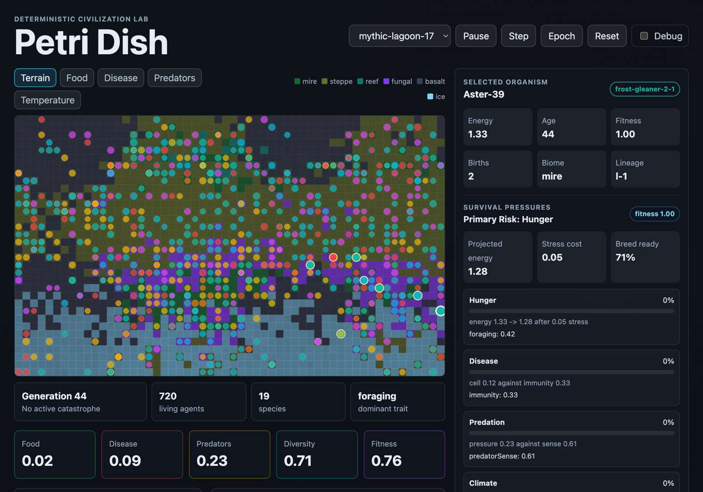
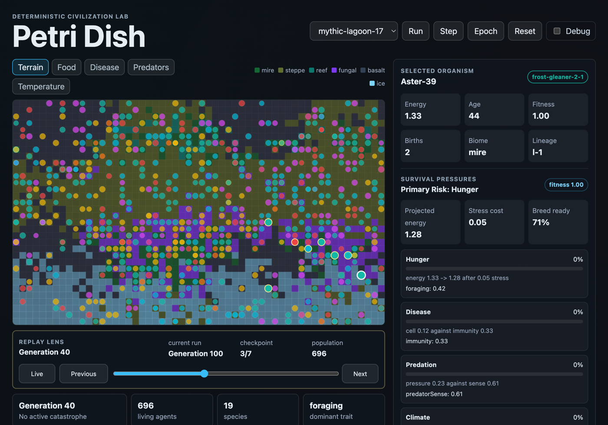
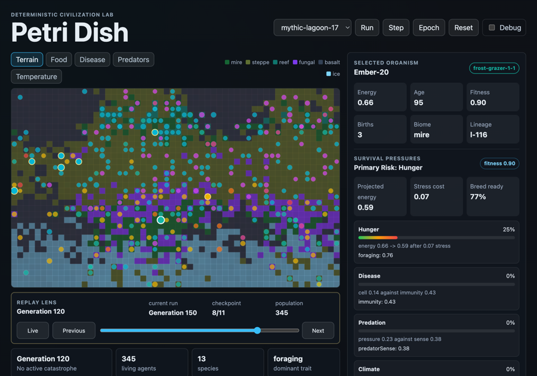
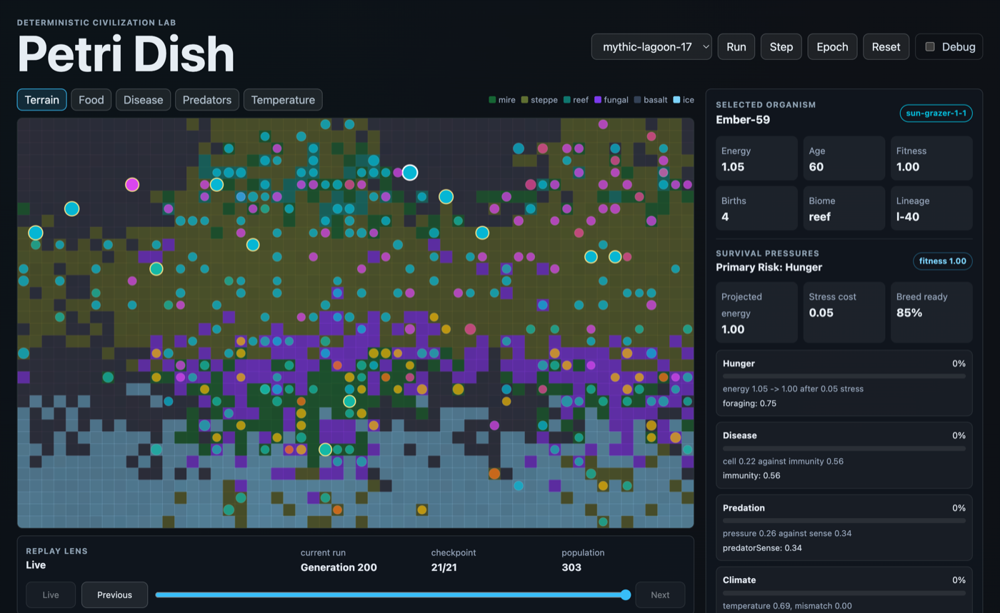

# Petri Dish

<p align="center">
  
</p>

**Petri Dish is a deterministic genetic-algorithm civilization lab.** Tiny autonomous creatures move across a living world, eat, migrate, reproduce, mutate, split into species, survive catastrophes, and leave behind inspectable dynasties.

This is not a fake dashboard. The map, timelines, extinction reports, pressure meters, lineage atlas, replay snapshots, and persistence state are all derived from real simulation state.

## Why It Exists

Petri Dish is built around one product idea: make evolution feel observable.

The app is a portfolio-grade simulation package where the cool is the product: a living map, colored clans, clickable creatures, genome and ancestry views, catastrophe aftermath, population curves, lineage survival stats, replayable generations, and persistent worlds that keep going after you close the browser.

## Feature Highlights

| Experience | What it does |
| --- | --- |
| Living world map | Creatures traverse terrain biomes with food, disease, predator pressure, fertility, temperature, and climate mismatch. |
| Real selection pressure | Starvation, disease, predators, crowding, climate mismatch, and catastrophes affect survival and reproduction. |
| Genome-to-behavior mapping | Each creature has traits for speed, metabolism, fertility, resilience, aggression, perception, immunity, heat preference, and cold preference. |
| Species and clans | Genomes derive species IDs and colors. Lineages form dynasties with living and dead descendants. |
| Clickable agents | Inspect a creature's genome, ancestry, mutations, fitness, births, kills, parents, lineage, and primary survival risks. |
| Replay lens | Scrub deterministic generation snapshots without rewinding the live world. |
| Event aftermath | Catastrophes and extinction clusters show before/after deltas for population, species, food, disease, predators, fitness, and diversity. |
| Lineage atlas | Dominant dynasties are ranked by living members, archived dead, species touched, mutation burden, fitness, and dominant traits. |
| Persistent worlds | Browser runs save locally, resume after reload, catch up deterministically, and expose storage health. |
| Verification loop | Unit tests, e2e render checks, responsiveness coverage, deterministic simulation reports, and CI keep the lab honest. |

## Screenshots

### Replayable Civilization History

<p align="center">
  
</p>

### Catastrophe Aftermath

<p align="center">
  
</p>

### Dynasty-Level Evolution

<p align="center">
  
</p>

## How To Run

Install dependencies:

```bash
npm install
```

Start the local app:

```bash
npm run dev -- --port 5175
```

Open:

```text
http://127.0.0.1:5175/
```

The app ships with deterministic demo seeds:

- `mythic-lagoon-17`
- `glass-drought-41`
- `ember-reef-93`

## How To Get The Best Experience

1. Let the world run for a few minutes, or use **Epoch** to advance 50 generations at a time.
2. Switch map overlays between terrain, food, disease, predators, and temperature to see the forces shaping evolution.
3. Click creatures on the map and inspect their survival pressure, genome, parents, mutations, and lineage.
4. Follow a selected lineage on the map. Living descendants stay highlighted while other creatures remain visible.
5. Use the replay scrubber to jump back through generation snapshots and compare history with the live world.
6. Watch the timeline for catastrophes, blooms, migrations, extinctions, and speciation events.
7. Open the lineage atlas and find the dynasties that are actually winning.
8. Close the browser tab, reopen the app, and confirm the same civilization resumes with bounded offline catch-up.
9. Use **Clear save** only when you intentionally want a fresh civilization.

## Simulation Model

The simulation core is framework-independent TypeScript. React renders and controls the world, but the ecology itself lives in `src/simulation`.

Core systems:

- `world.ts`: deterministic world creation and generation stepping.
- `rng.ts`: seedable random number generator for reproducible runs.
- `species.ts`: species IDs, colors, dominant traits, and species summaries.
- `pressure.ts`: survival pressure and fitness explanations for individual creatures.
- `snapshots.ts`: compact generation snapshots for replay.
- `impact.ts`: catastrophe and extinction aftermath reports.
- `lineage.ts`: dynasty survival atlas.
- `persistence.ts`: versioned persisted run contract.
- `offline.ts`: bounded offline catch-up planning and application.

Every generation updates terrain, food regeneration, disease, predators, creature movement, energy, stress costs, deaths, births, mutations, speciation, extinctions, and active world events. The UI reads from those structures instead of inventing presentation-only metrics.

## Persistence

Petri Dish is designed for long-running local worlds.

The browser persistence layer:

- Prefers IndexedDB for the full persisted run payload.
- Keeps a compact localStorage manifest for quick visible status.
- Migrates older localStorage saves forward.
- Persists seed, world state, selected creature, replay generation, snapshots, and metadata.
- Bounds persisted replay snapshots to keep storage under control.
- Applies deterministic offline catch-up when a saved run is reopened.
- Shows whether storage is nominal, large, or near limit.
- Keeps invalid/corrupt payloads visible until the user clears them.

No cloud account, database, paid service, or API key is required.

## Verification

Default local checks:

```bash
npm run lint
npm run typecheck
npm test
npm run build
```

Browser checks:

```bash
npm run test:e2e
```

Focused persistence check:

```bash
npm run test:e2e -- e2e/persistence.spec.ts
```

Deterministic simulation report:

```bash
npm run sim:report -- --seed mythic-lagoon-17 --generations 240
```

JSON report:

```bash
npm run sim:report -- --seed mythic-lagoon-17 --generations 240 --json
```

## Architecture

```text
src/
  App.tsx                       React shell, controls, canvas map, inspectors
  persistence/
    browserRunStore.ts          IndexedDB/localStorage browser adapter
  simulation/
    world.ts                    deterministic ecology engine
    pressure.ts                 creature-level survival explanations
    species.ts                  genome clustering and species summaries
    lineage.ts                  dynasty survival atlas
    impact.ts                   event aftermath analysis
    snapshots.ts                replayable generation snapshots
    persistence.ts              versioned saved-run schema
    offline.ts                  deterministic offline catch-up
scripts/
  sim-report.ts                 long-horizon report CLI
e2e/
  persistence.spec.ts           reload, catch-up, corrupt storage, clear-save checks
  render-smoke.spec.ts          nonblank app/render screenshot check
  responsiveness.spec.ts        long-run responsiveness and viewport checks
```

## Engineering Principles

- No fake demo stats.
- Deterministic seeds first.
- Simulation core independent from rendering.
- Inspectable agents over hidden magic.
- Observable state over vibes.
- Small verified slices over sprawling rewrites.
- Browser performance and responsiveness are product features.
- Persistence failures should be visible, not silent.

## Current Status

Recently completed delivery milestones:

- **Long-Run Stability & Responsiveness**: the app stays interactive during long runs and has regression coverage for frozen or sluggish worlds.
- **Evolution Observatory & Replay**: snapshots, replay, aftermath panels, and lineage storytelling make civilization history inspectable.
- **Persistent Long-Running Worlds**: local worlds survive reloads, resume with bounded offline catch-up, and persist durably through IndexedDB.

Petri Dish is still evolving. The next obvious frontier is making even richer emergent civilization stories: migration arcs, ecological niches, predator/prey specialization, deeper speciation pressure, and more cinematic long-run world memory.
